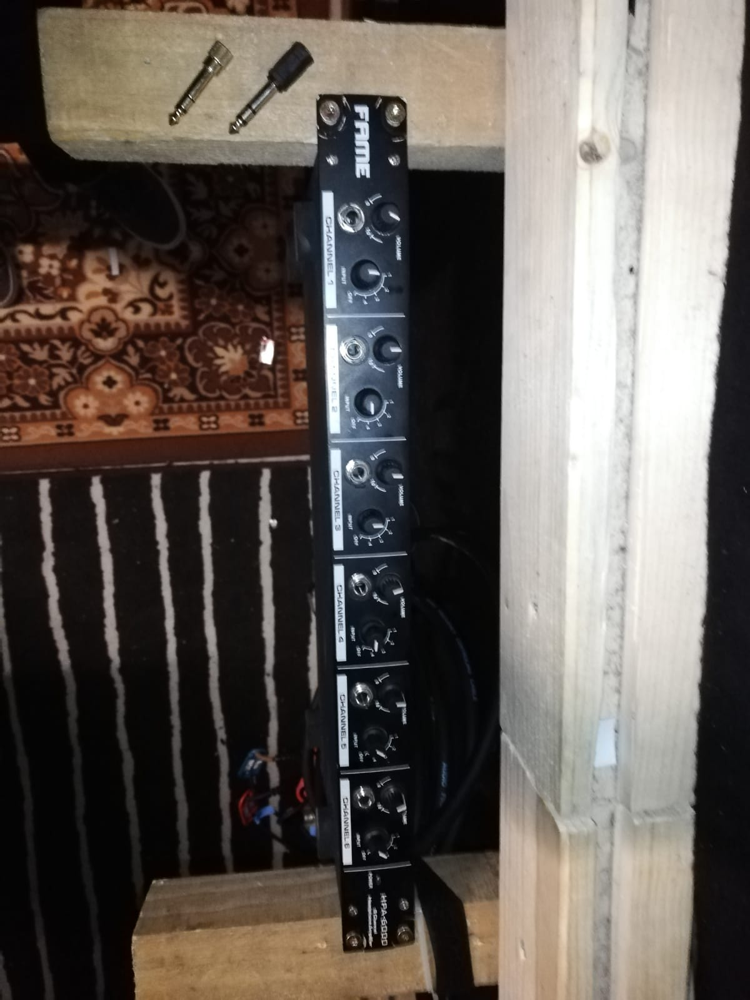
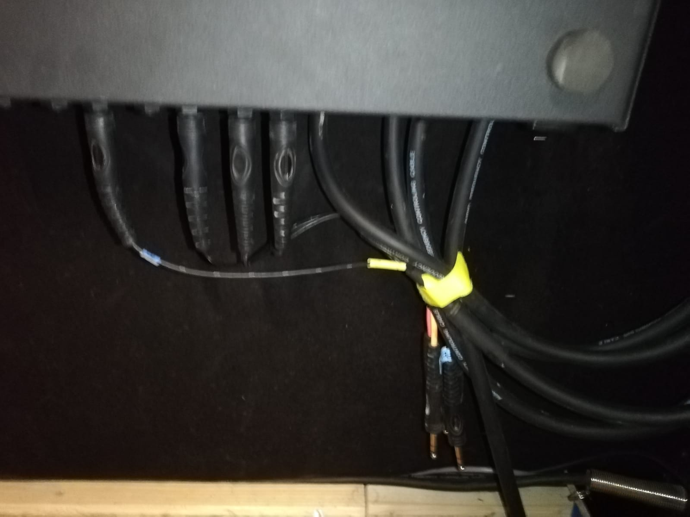

# Geräte

## X32 Rack

## SD8

## XR18

[{ align=right }](https://www.thomann.de/de/behringer_x_air_xr18.htm)
Das XR18 dient sowohl als Mischpult, als auch als Audiointerface.  
Bedient wird es außschließlich über Software:  
XREdit(PC-Systeme/Mobile), [XRQ](https://play.google.com/store/apps/details?id=com.behringer.android.control.app.xairq&gl=DE)(MobileApp um Monitormix zu machen)  
!!! important
    Änderungen bitte mit Felix absprechen

## Analoge Stagebox

## Kopfhörervestärker

### HA_INPUT

Hiermit kann der gewünschte Mix (FOH, Git 2, Voc 2) ausgewählt werden  

### HA_Buchse

Hier steckt ihr euren Kopfhörer rein

### HA_Volume

!!! danger "Lautstärke"
    Am besten bei 0 starten und langsam nach oben drehen. Pass auf deine Ohren auf!

Hier stellt ihr eure Lautstärke ein

## Kabelpeitsche XLR -> XLR

## Kabelpeitsche XLR -> TRSKlinke

