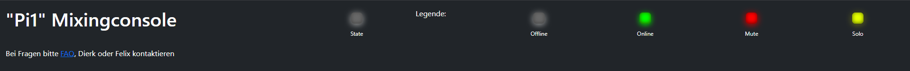
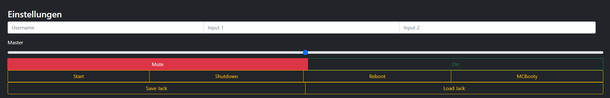
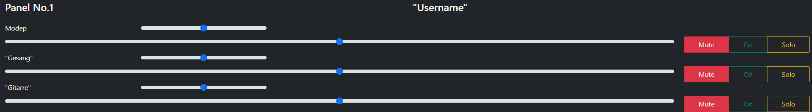

# Funktionen  

*Stand 22.08.2021*

- [Funktionen](#funktionen)
  - [Top der Seite](#top-der-seite)
  - [Einstellungen](#einstellungen)
  - [Panel](#panel)

## Top der Seite  

- "Pi1" dient als Platzhalter zur Darstellung des gewählten Endgeräts. Beispiele sind: "Pi1", "Ar-Pc", etc.  
- Die erste LED zeigt den aktuellen Status an (wird vermutlich noch ersetzt)  
- Die LEDs hinter Legende beschreiben möglichen Status (wird vermutlich noch entfernt)  
- Der Link "FAQ" führt zu dieser Seite  

## Einstellungen

Dieses Feld ist für allgemeine Einstellungen da.

  

- "Username": Trage hier bitte deinen Klarnamen ein. Andere Nutzer können "Klaus-Peter" besser zuordnen als "Honey-Badger93".
- "Input 1": Trage hier bitte das Instrument, z.B. Gesang oder Gitarre, ein das am {++ersten++} Input/Eingang eures Interfaces steckt.
- "Input 2": Trage hier bitte das Instrument, z.B. Gesang oder Gitarre, ein das am {++zweiten++} Input/Eingang eures Interfaces steckt.
- "Master": Hiermit kannst du die Gesamtlautstärke einstellen. Links ist leise, rechts ist laut.
- "Mute": Hiermit kannst du alles stummschalten.
- "On": Hiermit kannst du die Stummschaltung aufheben und wieder etwas hören, vorausgesetzt dein "Master" Fader ist nicht ganz links.
- "Start": Drücke diesen Knopf nur falls dein Endgerät (Pi1, Ar-Pc, etc.) noch nicht angeschaltet ist.
- "Shutdown": Mit diesem Knopf kannst du dein Endgerät herunterfahren. Mache dies bitte {++immer++} am Ende deiner Probe.
- "Reboot": Hiermit kannst du dein Endgerät neu starten.
- "McBooty": Hiermit kannst du das zentrale Programm neu starten. Bitte sehr gut überlegen ob du dies tun möchtest.
- "Save Jack": Hiermit kannst du "JackConnections" speichern. Bitte nur nutzen wenn du weißt was du machst.
- "Load Jack": Hiermit kannst du "JackConnections" laden. Bitte nur nutzen wenn du weißt was du machst.

## Panel

Hier kannst du die Einstellungen für Lautstärken und Stereopanning vornehmen.

  

- "No 1": Dient als Platzhalter hier wird das Gerät des jeweiligen Users angezeigt
- "Username": Hier wird der Username des entsprechenden Gerätenutzers angezeigt

Ein Channelstrip im Detail:

- "Modep": Bezeichnet das Instrument. Falls der entsprechende Nutzer in "Input 1"/"Input 2" etwas eingetragen hat wird dies hier angezeigt.
- "kleiner/erster Fader": Dieser ist für das Panning des jeweiligen Instruments zuständig. Analog zum Bild funktionieren diese von links nach rechts. Die Mitte ergibt ein neutrals links/rechts Verhältnis
- "großer/zweiter Fader": Dieser dient der Einstellung der Lautstärke des jeweiligen Instruments
- "Mute/On/Solo":
    - "Mute": Hiermit schaltest du das jeweilige Instrument stumm
    - "On": Hiermit schaltest du das jeweilige Instrument "scharf"/an
    - "Solo": Aktivierst du Solo, werden alle anderen Instrumente stumm geschalten und du hörst nur noch das entsprechende Instrument
