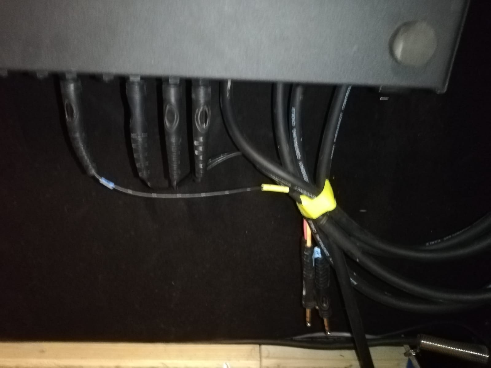
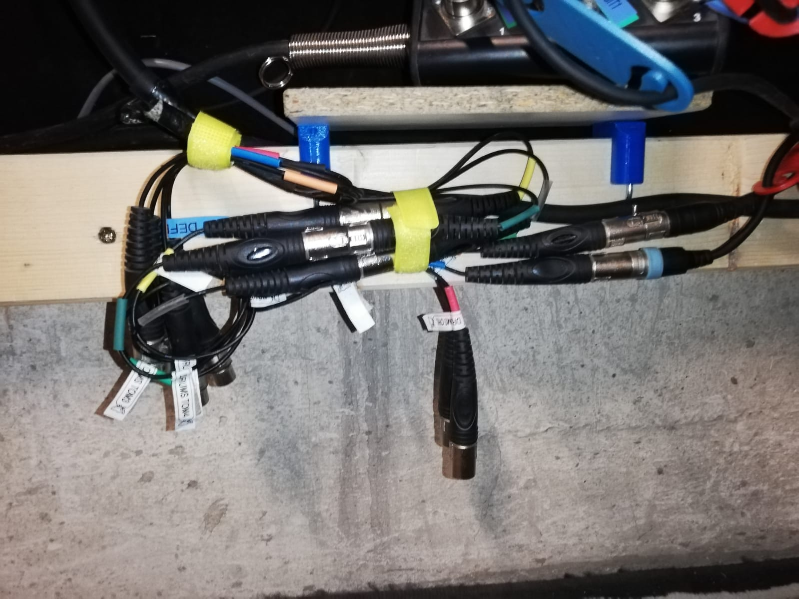
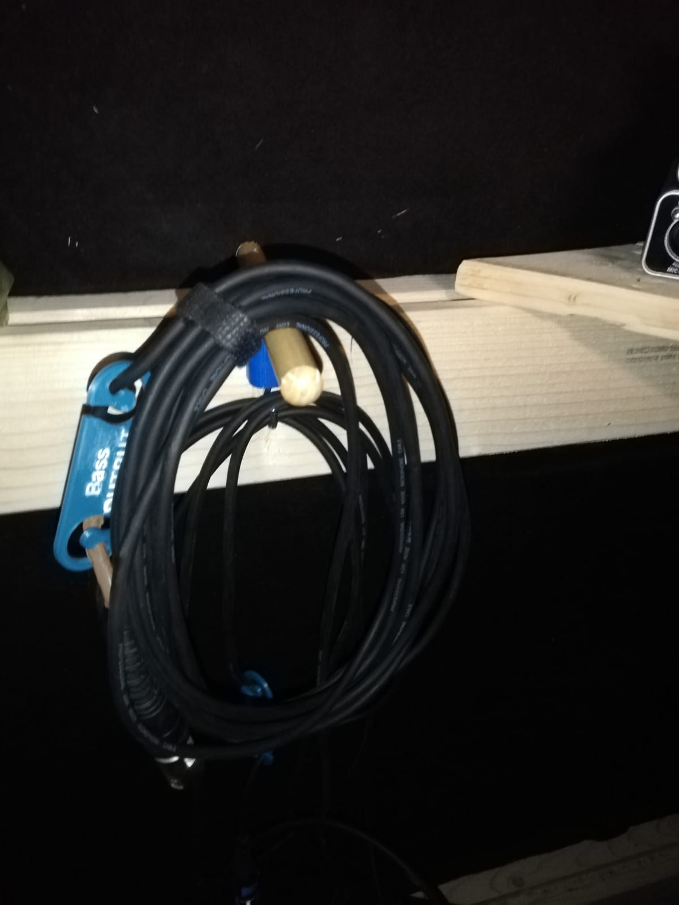
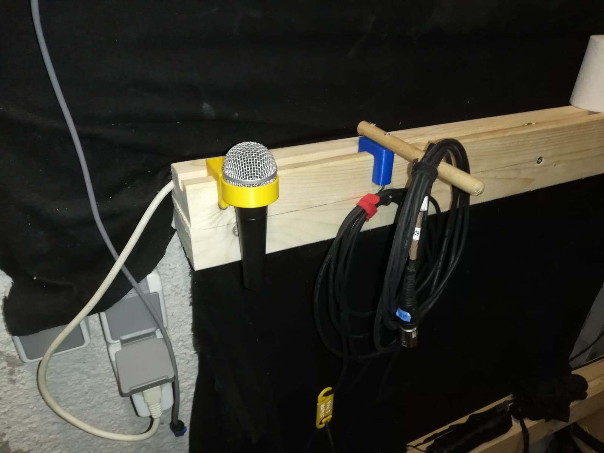
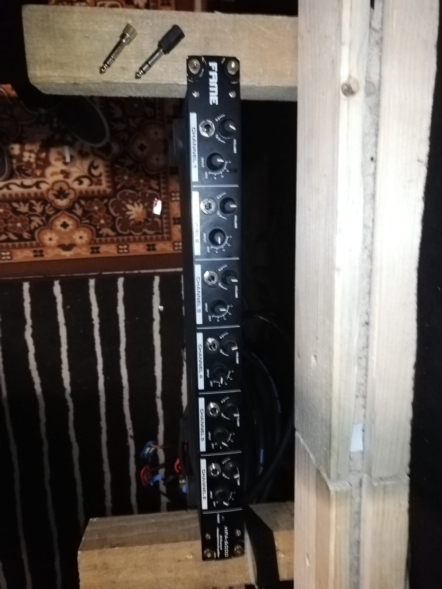
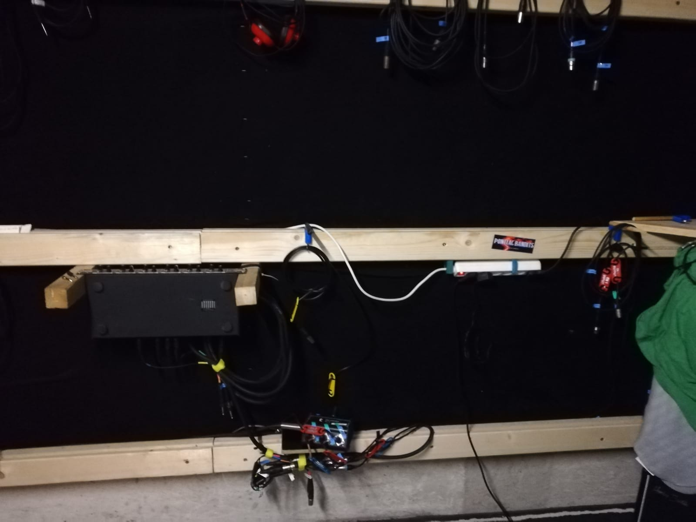
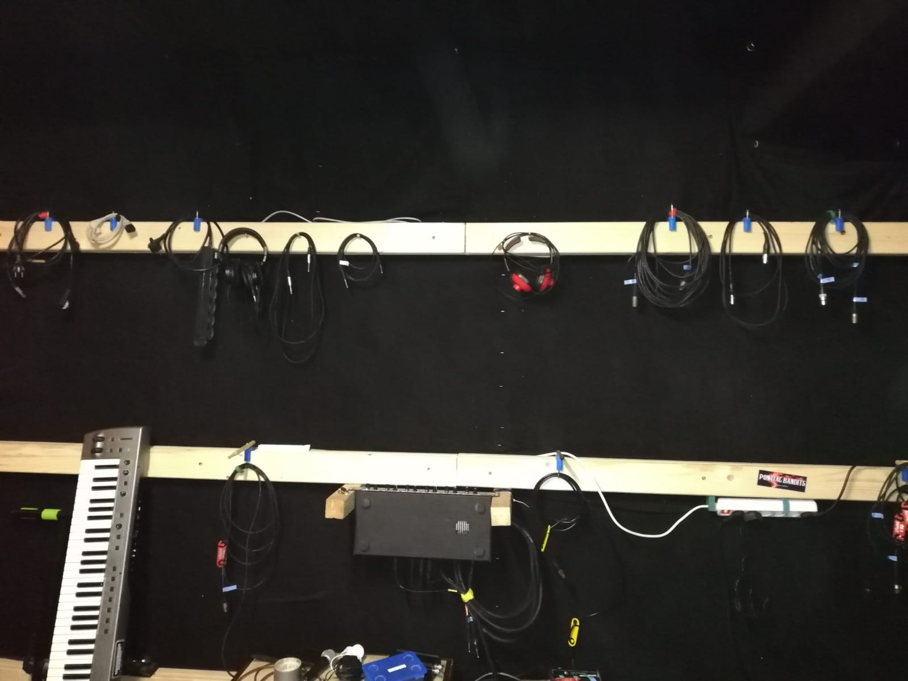
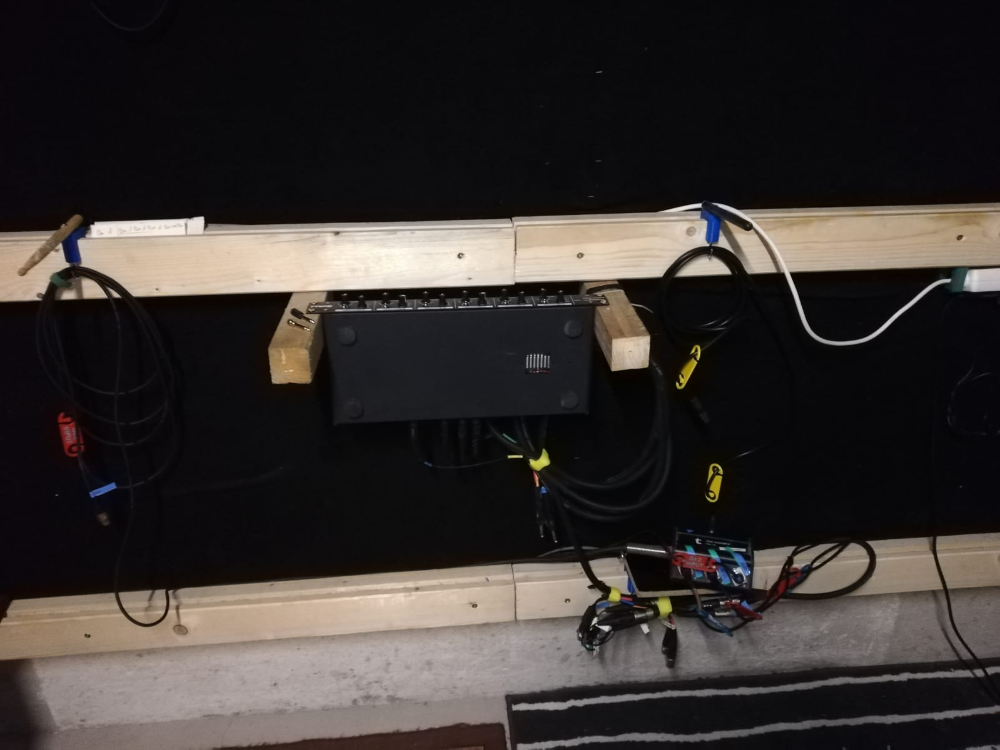
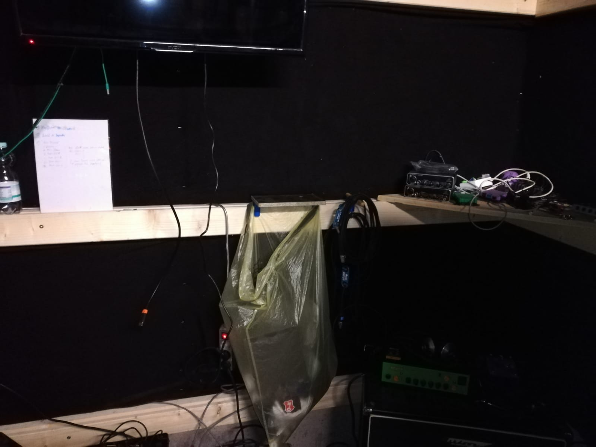
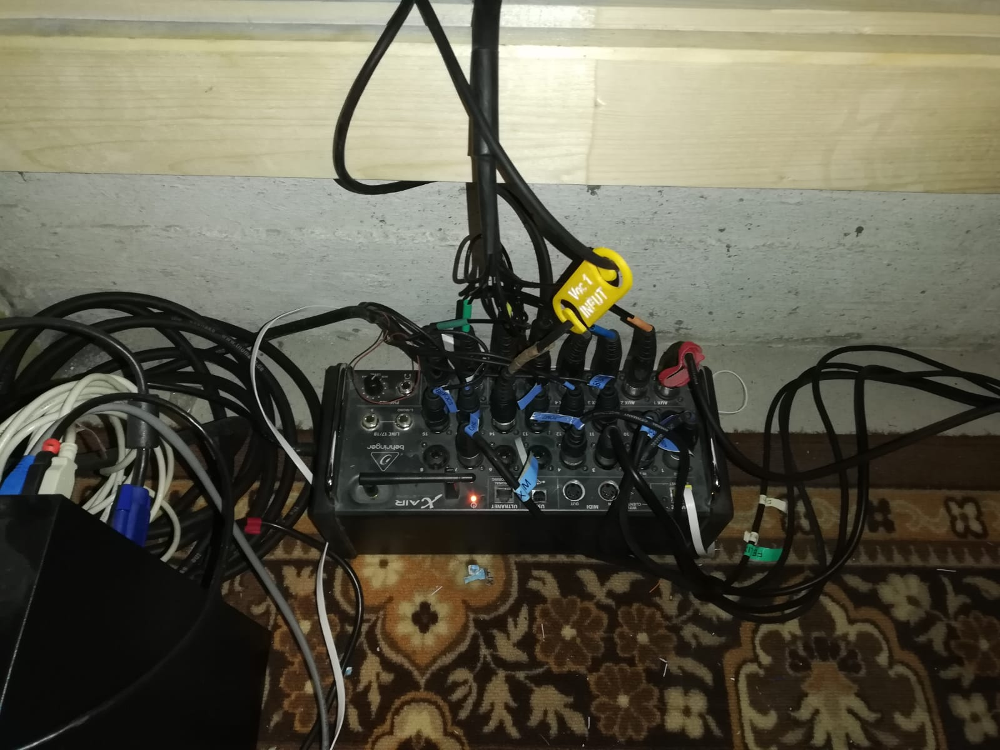

# Hühnerstall

## Besonderheiten

- IP Adresse: 192.168.2.13
- Es gibt analogen Stageboxen und Kabelpeitschen
- Ein Mehrfachkopfhörerverstärker ist im Einsatz

## Verkabelung

### XR18

#### Input

|             | 1    | 2     | 3     | 4     | 5     | 6     | 7    | 8    | 9        | 10  | 11    | 12        | 13        | 14       | 15       | 16    | 17  | 18  |
| ----------- | ---- | ----- | ----- | ----- | ----- | ----- | ---- | ---- | -------- | --- | ----- | --------- | --------- | -------- | -------- | ----- | --- | --- |
| **Stecker** | Kick | Snare | Tom 1 | Tom 2 | Tom 3 | HiHat | OH L | OH R | Drums DI |     | SBA 1 | SBA 2     | SBA 3     | Voc 1    | SBA 5    | SBA 6 |     |     |
| **Ziel**    | Kick | Snare | Tom 1 | Tom 2 | Tom 3 | HiHat | OH L | OH R | Drums DI |     | Bass  | Gitarre 1 | Gitarre 2 | Vocals 1 | Vocals 2 | Bonus |     |     |

#### Output

| 1     | 2          | 3        | 4        | 5     | 6         | Main L       | Main R         |
|  :--------: |  :--------: | :--------: |  :--------: |  :--------: |  :--------: |  :--------: |  :--------: |
| Drums | KP1 Orange | KP1 Blau | KP1 Gelb | Voc 1 | KP1 Clear | KP1 HellGrün | KP1 DunkelGrün |
| Drums | Bass       | Git 1    | Git 2    | Voc 1 | Voc 2     | FOH L        | FOH R          |

### Kopfhörerverstärker

Der [Kopfhörerverstärker](/devices/#kopfhorervestarker) hat vier Eingänge  some *blue* text die beliebig auf sechs Ausgänge geroutet werden können. Siehe Bild

#### Input

| **Klinkenbuchse** | 1 L                                             | 1 R                                               | 2 L      | 2 R | 3 L       | 3 R | 4 L | 4 R |
| ----------------- | ----------------------------------------------- | ------------------------------------------------- | -------- | --- | --------- | --- | --- | --- |
| **Klinke**        | KP1 Hellgrün | KP1 Dunkelgrün | KP2 Gelb |     | KP2 Clear |     |     |     |
| **Ziel**          | FOH L                                           | FOH R                                             | Git 2    |     | Voc 2     |     |     |     |

#### Output

Die Wahl der [Buchse](/devices/#buchse) ist egal, mit der Wahl des [Channel](/devices/#channel) kann eine Quelle ausgewählt werden

| **Channel** | 1   | 2     | 3     | 4   |
| ---------- | --- | ----- | ----- | --- |
|            | FOH | Git 2 | Voc 2 |     |

### SBA analoge 6 Wege Stagebox

> Die Stagebox wird genutzt um Inputs an das XR18 weiterzureichen

#### Input

XLR Female Stecker

| 1       | 2       | 3       | 4   | 5       | 6       |
| ------- | ------- | ------- | --- | ------- | ------- |
| XR18 11 | XR18 12 | XR18 13 |     | XR18 15 | XR18 16 |

#### Output

XLR Male Buchse

| 1    | 2         | 3         | 4   | 5        | 6     |
| ---- | --------- | --------- | --- | -------- | ----- |
| Bass | Gitarre 1 | Gitarre 2 |     | Vocals 2 | Bonus |

### KP1 XLR -> XLR Kabelpeitsche

#### Input 

XLR Female

| 1   | 2   | 3   | 4   | 5   | 6   | 7   | 8   |
| --- | --- | --- | --- | --- | --- | --- | --- |
|     |     |     |     |     |     |     |     |

#### Output 

XLR Male

| 1   | 2   | 3   | 4   | 5   | 6   | 7   | 8   |
| --- | --- | --- | --- | --- | --- | --- | --- |
|     |     |     |     |     |     |     |     |

### KP2 XLR -> Klinke Kabelpeitsche

#### Input 

XLR Female

| 1   | 2   | 3   | 4   | 5   | 6   | 7   | 8   |
| --- | --- | --- | --- | --- | --- | --- | --- |
|     |     |     |     |     |     |     |     |

#### Output 

Klinke Male TRS symmetrisch

| 1   | 2   | 3   | 4   | 5   | 6   | 7   | 8   |
| --- | --- | --- | --- | --- | --- | --- | --- |
|     |     |     |     |     |     |     |     |

