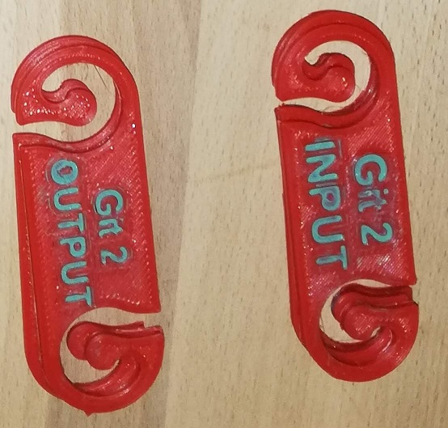

# Kable Management

Diese Seite dient als Anhaltspunkt wie Kabel verlegt wurden und was sich dabei gedacht wurde  

!!! notification "Work in progress"
    Die Dokumentation befindet sich im Aufbau.

## Grundsätzlich

- Kabel bekommen einen Tag, siehe Bild
- Bitte nicht an Kabeln ziehen...
- Falls Unklarheiten bestehen, lies bitte hier nach, sollten sich weitere Fragen ergeben, fragt bitte nach
- Falls du etwas nach Absprache veränderst, notiere dies und teile es Felix mit

## Tags

{ align=right }
Mit diesen Tags werden Kabel an beiden Enden markiert. Pro Raum soll eine Tag-ID nur einmal genutzt werden.  
Beispiele für Tag-IDs sind "Voc 1 INPUT", "Bass INPUT", "Voc 2 OUTPUT", etc.
