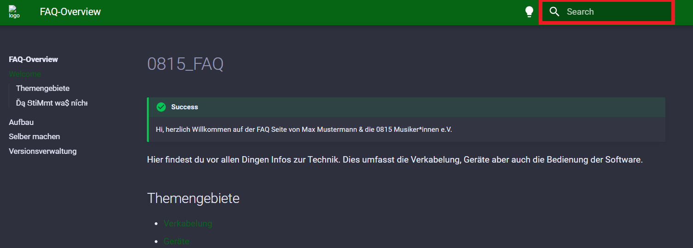

# Aufbau der FAQ

- [Aufbau der FAQ](#aufbau-der-faq)
  - [Format](#format)
  - [Funktionen](#funktionen)
    - [Suche](#suche)
    - [Erscheinungsbild](#erscheinungsbild)

## Format

Die FAQ wird online als Website bereitgestellt. Eine Offlinevariante soll im Bedarfsfall im Bunker zur Verfügung gestellt werden.  

!!! quote Link
    http://faq.0815Musiker-innen.de
Die FAQ sollte im besten Fall auf allen Geräte mit einem Browser (Firefox, Edge, Chrome) gut lesbar dargestellt werden können.  
Wenn ihr euch in die Gestaltung der FAQ miteinbringen möchtet, lest euch bitte zunächst die [Anleitung](diy.md) dazu durch.  

## Funktionen

### Suche

Die wahrscheinlich wichtigste Funktion auf der Seite. Diese findet ihr oben rechts 

### Erscheinungsbild

Einfach mal ausprobieren

