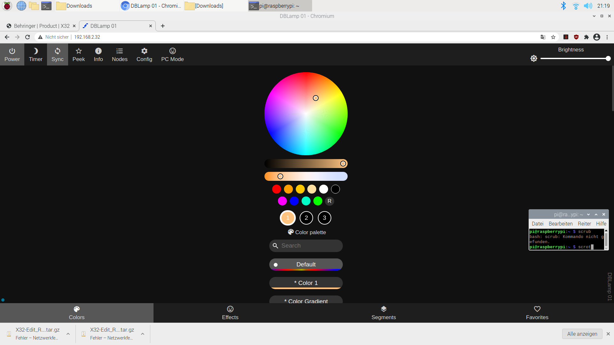
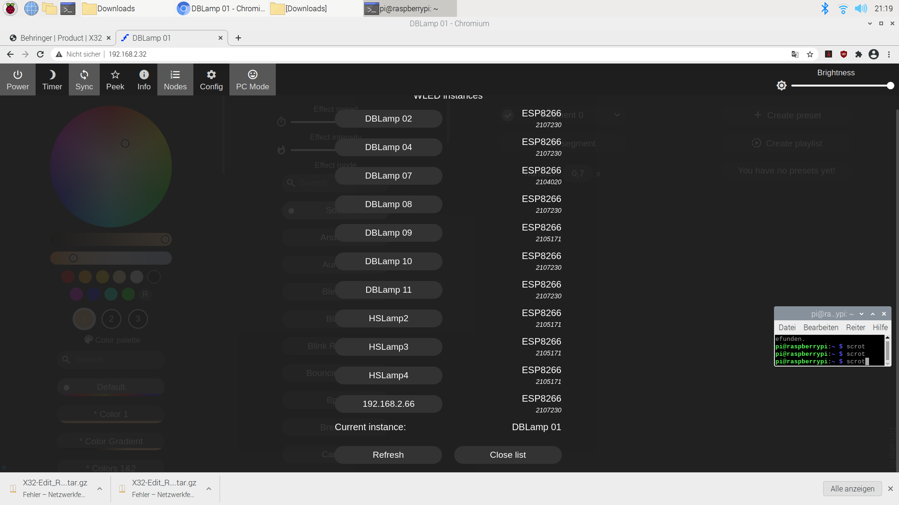

# Licht

!!! info
    Gilt bisher nur für den Dachsbau, im Hühnerstall funktioniert der normale Lichtschalter
    !!! important "[IP-Adresse](http://192.168.2.32)"
        [192.168.2.32](http://192.168.2.32)

## Konzept

Um ein angenehmeres Licht zu haben sind flexible LED Streifen an, mit Dämmstoff gefüllten, Panelen aufgehängt. Diese sind in der Farbe frei wählbar und auch in der Lage Effekte wiederzugeben.  

  

!!! info
    === "Power"
        Damit kannst du eine Lampe an und aus machen ^^

    === "Timer"
        Die Lampe geht nach 60 Minuten aus

    === "Sync"
        Damit steuerst du alle Lampen
        !!! important "Wichtig"
            Gilt momentan noch für alle Lampen in allen Räumen!!!

    === "Peek"
        Gibt eine live Vorschau im Browser wieder

    === "Info"
        Allerlei Infos zu Stromverbrauch, Versionsnummer, etc.

    === "Nodes"
        Zeigt eine Liste aller im Netzwerk verfügbaren Lampen an
         

    === "Config"
        Öffnet das Config Menü
        !!! danger "Achtung"
            Bitte nur Änderungen vornehmen wenn du genau weißt was du tust

    === "PC Mode"
        Solltest du an einem DesktopPc oder Laptop sein, unbedingt drücken, macht alles übersichtlicher

        